# 3D Interactive Portfolio 🚀

An immersive, premium 3D developer portfolio website built using **React**, **Three.js**, and **React Three Fiber (R3F)**. The portfolio places the visitor inside an interactive 3D developer room/workspace where they can interact with physical objects to explore projects, credentials, resume, tools, and real-time GitHub activity.

---

## 🎨 Design & Theme System

- **Aesthetic**: Premium dark-mode workspace using soft lighting, neon accent glows, and responsive glassmorphism overlays.
- **Dynamic Theme Switcher**: 5 gorgeous pre-configured theme presets that instantly adjust the 3D scene's colors, ambient lighting, spotlight accents, fog, and HTML UI overlays:
  - **Cyber Emerald** (`cyberpunk`): High-tech neon teal and magenta.
  - **Neon Sunset** (`sunset`): Warm purple, pink, and orange gradient highlights.
  - **Deep Ocean** (`ocean`): Cool, deep marine blues and purples.
  - **Vibrant Amber** (`amber`): Golden, retro warm amber tones.
  - **Tokyo Night** (`tokyo`): High-tech neon purple and cyan.
- **Interactivity**: Clicking on 3D objects in the room seamlessly zooms the camera to focus on them while fading in rich 2D UI panels.
- **Micro-animations**: Smooth hover transitions, floating 3D elements, pulsing notifications, and Framer Motion transitions.

---

## 🛠️ Tech Stack

- **Framework**: React 19 + Vite 8
- **3D Engine**: Three.js
- **React 3D Renderer**: React Three Fiber (R3F)
- **3D Helpers**: `@react-three/drei`
- **Animations**: `framer-motion` (2D overlays) and Three.js Lerp (3D Camera navigation)
- **Icons**: `lucide-react`
- **Styling**: Vanilla CSS (Custom properties, theme variables, and modern flex/grid layouts)

---

## 🏗️ Architectural System Design

This project uses a unified architecture where **React Router** state acts as the single source of truth for both the 2D overlays and the 3D viewport. When a user clicks a navigation link or a 3D mesh, the route changes, triggering:
1. **Camera Transitions**: The `CameraMover` component intercepts route changes and runs a smooth interpolation loop (`lerp`) using R3F's `useFrame` to position and rotate the camera.
2. **2D Overlay Mounting**: React Router mounts the corresponding overlay page with smooth enter/exit animations handled by `framer-motion`.
3. **Theme Synchronization**: The global `themeId` state is saved to `localStorage` and applied as a `data-theme` attribute on the HTML root element. This instantly swaps out CSS custom variables for the UI, while also propagating color variables down into R3F materials and lights.

### 📊 System Architecture Diagram

```mermaid
graph TD
    %% Box 1: Routing System
    subgraph Routing ["Routing System"]
        Router["React Router v7 (routes/index.jsx)"]
    end

    %% Box 2: Theme Engine
    subgraph Theme_Engine ["Theme Engine"]
        Theme["Theme State (App.jsx)"]
        LS["LocalStorage ('portfolio-theme')"]
        HTMLAttr["HTML root 'data-theme'"]
    end

    %% Box 3: Global UI Layout
    subgraph Global_UI ["Global UI Elements"]
        Nav["Navigation.jsx (Float Menu)"]
        Set["Settings.jsx (Theme Selector)"]
        Loader["Loader.jsx (Preloader)"]
    end

    %% Box 4: Routed 2D Overlays
    subgraph Routed_Overlays ["Routed 2D Overlays"]
        Home["Home.jsx (Intro Overlay)"]
        Proj["Projects.jsx (List & Modals)"]
        Certs["Certificates.jsx (List & Tile Toggle)"]
        Resume["Resume.jsx (Experience & Tech Skills)"]
        Git["Github.jsx (CRT Command Shell)"]
        Tools["Tools.jsx (Categorized Grid)"]
        Contact["Contact.jsx (Form & Social Links)"]
    end

    %% Box 5: 3D Canvas Core
    subgraph Canvas_Core ["3D Canvas Core"]
        CanvasComponent["Canvas Component (App.jsx)"]
        Room["Room.jsx (Core Scene Wrapper)"]
        Lights["Lights.jsx (Spotlights & Fog)"]
        CameraMover["CameraMover.jsx (useFrame Lerp)"]
    end

    %% Box 6: 3D Interactive Meshes
    subgraph Interactive_Meshes ["3D Interactive Meshes"]
        Desk["Desk.jsx (Workstation Setup)"]
        Laptop["Laptop.jsx (Drei &lt;Html&gt; Screen)"]
        Bookshelf["Bookshelf.jsx (Shelves & Credentials)"]
        WallFrames["WallFrames.jsx (Certificates)"]
        Terminal["Terminal.jsx (CRT Screen)"]
        Smartphone["ContactObject.jsx (Phone Model)"]
        Clipboard["Clipboard.jsx (Physical Clipboard)"]
    end

    %% Box 7: External Integrations
    subgraph External_Integrations ["External Integrations"]
        GitAPI["GitHub REST API"]
        W3Forms["Web3Forms API"]
        Devicon["jsdelivr Devicon CDN"]
    end

    %% Routing & Overlay Bindings
    Router -->|Mounts page overlay| Home
    Router -->|Mounts page overlay| Proj
    Router -->|Mounts page overlay| Certs
    Router -->|Mounts page overlay| Resume
    Router -->|Mounts page overlay| Git
    Router -->|Mounts page overlay| Tools
    Router -->|Mounts page overlay| Contact

    %% Theme sync and propagation
    Theme -->|Syncs| LS
    Theme -->|Updates| HTMLAttr
    HTMLAttr -->|Controls CSS theme variables| Global_UI
    HTMLAttr -->|Controls CSS theme variables| Routed_Overlays
    Theme -->|Configures light colors & intensity| Lights
    Theme -->|Configures colors & glow materials| Room

    %% 3D Scene Assembly
    CanvasComponent --> Room
    Room --> Lights
    Room --> CameraMover
    Room --> Desk
    Room --> Laptop
    Room --> Bookshelf
    Room --> WallFrames
    Room --> Terminal
    Room --> Smartphone
    Room --> Clipboard

    %% Interactive camera trigger bindings
    Router -->|Configures Target Position & FOV| CameraMover
    Laptop -->|User Click: routes to /projects| Router
    WallFrames -->|User Click: routes to /certificates| Router
    Terminal -->|User Click: routes to /github| Router
    Smartphone -->|User Click: routes to /contact| Router
    Bookshelf -->|User Click: routes to /tools| Router
    Clipboard -->|User Click: routes to /resume| Router

    %% Dynamic Data bindings
    Git -->|Queries user & repo data| GitAPI
    Contact -->|Submits email payload| W3Forms
    Tools -->|SkillLogo pulls SVGs| Devicon
```



---

## 📂 Project Folder Structure

```text
3d-portfolio/
├── public/
│   ├── models/               # 3D .gltf / .glb asset models
│   ├── textures/             # Image textures for custom meshes
│   ├── icons.svg             # SVG sprite sheets
│   └── resume.pdf            # Downloadable resume document
├── src/
│   ├── assets/               # Local images, project screenshots, certificates
│   ├── components/
│   │   ├── canvas/           # React Three Fiber (R3F) 3D Components
│   │   │   ├── Room.jsx      # Core Room wrapper (holds desk, walls, flooring, rug)
│   │   │   ├── Desk.jsx      # Desk unit + workstation setups (keyboard, mouse, mug, plant)
│   │   │   ├── Laptop.jsx    # Virtual computer screen using Drei <Html> (Project explorer)
│   │   │   ├── Bookshelf.jsx # Interactive shelf holding credentials/hobbies
│   │   │   ├── WallFrames.jsx# Frames on the wall displaying certificates
│   │   │   ├── Clipboard.jsx # Clipboard for Resume reading
│   │   │   ├── Terminal.jsx  # Interactive CRT terminal for GitHub activity
│   │   │   ├── ContactObject.jsx # Interactive 3D smartphone for messaging
│   │   │   └── CameraMover.jsx # Interpolates camera position, lookAt target, and FOV based on routing
│   │   └── ui/               # Reusable 2D UI Components
│   │       ├── Navigation.jsx# Glassmorphism overlay menu
│   │       ├── Loader.jsx    # Preloader overlay with progress feedback
│   │       ├── Settings.jsx  # Configuration dropdown for themes
│   │       ├── Icons.jsx     # Reusable custom SVG icons
│   │       ├── SkillLogo.jsx # [NEW] Fetches tech stack SVG logos dynamically from CDN
│   │       └── ScrambleText.jsx# Digital scramble/decrypt text animation component
│   ├── pages/                # Route components (2D HTML overlays)
│   │   ├── Home.jsx          # Intro overlay (Overall room view)
│   │   ├── Projects.jsx      # Project list & details modal
│   │   ├── Certificates.jsx  # Certificate viewer gallery with view style toggle
│   │   ├── Resume.jsx        # Online resume viewer & PDF download (clean style)
│   │   ├── Github.jsx        # Retro terminal shell querying GitHub API
│   │   ├── Tools.jsx         # Categorized tools dashboard (list/tile layouts)
│   │   └── Contact.jsx       # Contact form with validation and social links
│   ├── routes/
│   │   └── index.jsx         # React Router v7 routing configuration
│   ├── config/
│   │   └── themes.js         # Theme preset configs (colors, custom light values)
│   ├── App.css               # Base styles
│   ├── App.jsx               # R3F Canvas + 2D Overlay Layout & Theme State
│   ├── index.css             # Unified CSS design system & custom properties
│   └── main.jsx              # Application entrypoint
```

---

## ✨ Features & Recent Enhancements

### 1. 3D Interactive Room
- Built with custom geometries and lightmaps representing a developer's study room.
- Dynamic environment maps, spotlights, and distance fog that change color schemes when themes are updated.
- Smooth camera focal shifting on object selection.

### 2. Multi-Layout Tools Dashboard (`Tools.jsx`)
- **Categorization**: Tools are organized into functional groups (**Frontend, Backend, Databases, Frameworks**) and toggleable via a visual tab bar.
- **View Toggle Layouts**: Added support for switching between:
  - **List View**: Detailed, single-column vertical layout.
  - **Tile View**: Space-saving dense grid representation.
  - **Large Tile View**: Generous grid display utilizing larger icons.
- **Progress Indicator Removal**: Replaced percentage-based progress bars with tech badges to emphasize clean layouts, focusing purely on tool names and logos.

### 3. Dynamic Skill Badges (`SkillLogo.jsx`)
- An dynamic logo fetcher that requests official SVG vectors from the **Devicon CDN** (via `jsdelivr`).
- Includes built-in error boundaries that gracefully fall back to colored textual tags when an icon fails to load or does not exist in the Devicon catalog.

### 4. Simplified Professional Resume (`Resume.jsx`)
- Chronological timelines for experience (Quanby Solutions Inc., SORECO II) and education (Sorsogon State University, BNCHS).
- Clean bullet-point indicators for technical infrastructure skills. All visual progress bar and completion-percentage elements have been removed to present a clean, professional recruiter layout.

### 5. Configurable Certificates Gallery (`Certificates.jsx`)
- **View Style Toggles**: Allows users to toggle between a clean **List View** showing issuers/IDs and a custom **Tile View** showing detailed certificate frames.
- **Interactive Modals**: Clicking a certificate zooms the camera, launches celebratory confetti, and opens a simulated physical certificate sheet showing the recipient **ARVIN CATALBAS** with certificate metadata and signatures.

### 6. Interactive Retro CRT Github Terminal (`Github.jsx`)
- Interactive CRT screen mesh. Clicking it opens a retro terminal layout that displays mock commands and makes real-time requests to the GitHub REST API, listing your public repositories and project counts.

### 7. smartphone messaging Contact Form (`Contact.jsx`)
- Interactive smartphone 3D object on the desk that zooms to trigger the contact card.
- Validated form with custom state checking connected to the **Web3Forms API** for email delivery, with demo failover support.

---

## 📦 Dependencies

Here are the key packages required for the project:

### Production Dependencies (`dependencies`):
- `three`: Core 3D engine library.
- `@react-three/fiber`: React wrapper for Three.js.
- `@react-three/drei`: Useful helpers, controls, and components (e.g. `<Html>`, `<PerspectiveCamera>`).
- `@react-three/postprocessing`: Advanced post-processing effects (glows, ambient occlusion).
- `react-router-dom` (v7): Manages URL routing linked to camera look-at nodes.
- `framer-motion`: Smooth spring animations for 2D overlays and modals.
- `lucide-react`: Modern SVG vector icons.
- `canvas-confetti`: Triggered during certificate unlocks/resume viewing.

### Development Dependencies (`devDependencies`):
- `vite`: Fast build tool and development server.
- `@types/three`: Type definitions for Three.js.
- `@types/canvas-confetti`: Type definitions for Confetti.
- `eslint`: Code linting tool.

---

## 🚀 Getting Started

### 1. Clone & Install
```bash
git clone <your-repo-url>
cd 3d-portfolio
npm install
```

### 2. Environment Configuration
Create a `.env` file in the root directory (or copy `.env.example`) and add your Web3Forms access key for the contact form to function:
```bash
# Rename the example file
cp .env.example .env
```
Then, edit the `.env` file and replace `your_access_key_here` with your actual Web3Forms access key:
```env
VITE_WEB3FORMS_ACCESS_KEY=your_access_key_here
```

### 3. Run the Development Server
```bash
npm run dev
```

### 4. Production Build
```bash
npm run build
```
